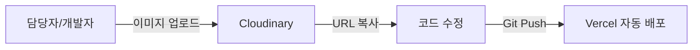
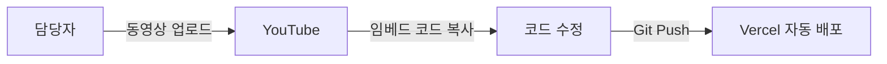
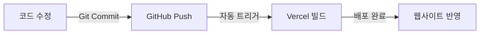
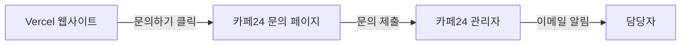
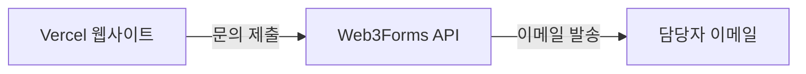
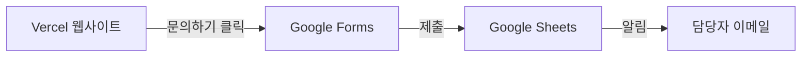

# 웹사이트 유지보수 가이드

## 개요

이 문서는 네오아크로보틱스 웹사이트의 유지보수 방법을 설명합니다.


## 요약

### 1. 이미지 업데이트 (Cloudinary)



- Cloudinary 대시보드 접속 방법
- 이미지 업로드 상세 절차
- URL 복사 및 코드 수정 방법
- 이미지 최적화 팁 (자동 포맷, 품질, 크기 조절)

### 2. 동영상 업데이트 (YouTube)



- YouTube Studio 업로드 방법
- 임베드 코드 복사 방법
- YouTube 임베드 옵션 (자동재생, 음소거, 시작 시간 등)

### 3. 문의 폼 옵션

| 방법 | 비용 | 한도 | 추천 상황 |
|------|------|------|----------|
| 카페24 | 무료 | 무제한 | 장기 운영, 문의 기록 필요 |
| Web3Forms | 무료 | 월 250건 | 간단한 문의만 |
| Google Forms | 무료 | 무제한 | 예산 없을 때 |
---

## 1. 플랫폼 계정 정보

### 계정 목록

| 플랫폼 | URL | 용도 | 로그인 이메일 |
|--------|-----|------|--------------|
| Vercel | vercel.com | 웹 호스팅 | dev@neoarcrobotics.com |
| GitHub | github.com | 코드 관리 | dev@neoarcrobotics.com |
| Cloudinary | cloudinary.com | 이미지 관리 | dev@neoarcrobotics.com |
| YouTube | studio.youtube.com | 동영상 관리 | dev@neoarcrobotics.com |
| 카페24 | cafe24.com | 도메인/쇼핑몰 | 담당자 이메일 |

### 권한 관리

| 역할 | 권한 | 담당자 |
|------|------|--------|
| 소유자 (Owner) | 모든 권한, 결제 관리 | 대표이사 또는 IT 임원 |
| 관리자 (Admin) | 배포, 설정 변경 | 웹 담당자 |
| 개발자 (Developer) | 코드 수정, 배포 | 개발팀원 |

---

## 2. 일반 유지보수 작업

### 텍스트/내용 수정



**절차:**
1. 코드 에디터에서 해당 파일 수정
2. 터미널에서:
   ```bash
   git add .
   git commit -m "텍스트 수정: 회사 소개 업데이트"
   git push origin main
   ```
3. Vercel이 자동으로 배포 (약 1-2분 소요)
4. 웹사이트에서 확인

### 이미지 업데이트 (Cloudinary)


**상세 절차:**

1. **Cloudinary 접속**
   - https://cloudinary.com 로그인
   - Media Library 메뉴 클릭

2. **이미지 업로드**
   - 우측 상단 "Upload" 버튼 클릭
   - 이미지 파일 드래그 앤 드롭
   - 폴더 선택 (예: `neoarc/products/`)

3. **URL 복사**
   - 업로드된 이미지 클릭
   - 우측 패널에서 URL 복사
   - 예: `https://res.cloudinary.com/dzu2wygbi/image/upload/v1234567890/파일명.jpg`

4. **코드 수정**
   - 해당 컴포넌트 파일에서 이미지 URL 교체
   - 예: `client/src/components/HeroSection.tsx`

5. **배포**
   ```bash
   git add .
   git commit -m "이미지 업데이트: 메인 배너 변경"
   git push origin main
   ```
   - Vercel 자동 배포 (1-2분 소요)

**Cloudinary 이미지 최적화 팁:**
- 자동 포맷: URL에 `/f_auto/` 추가
- 자동 품질: URL에 `/q_auto/` 추가
- 크기 조절: URL에 `/w_800/` 추가 (너비 800px)
- 예: `https://res.cloudinary.com/dzu2wygbi/image/upload/f_auto,q_auto,w_800/v1234567890/파일명.jpg`

---

### 동영상 업데이트 (YouTube)


**상세 절차:**

1. **YouTube 업로드**
   - https://studio.youtube.com 접속
   - "만들기" → "동영상 업로드" 클릭
   - 동영상 파일 선택
   - 제목, 설명 입력
   - 공개 설정: "공개" 또는 "일부 공개"
   - "게시" 클릭

2. **임베드 코드 복사**
   - 업로드된 동영상 페이지로 이동
   - "공유" 버튼 클릭
   - "퍼가기" 클릭
   - iframe 코드 복사

3. **코드 수정**
   - 해당 컴포넌트 파일에서 iframe 코드 교체
   - 예시:
   ```html
   <iframe 
     width="560" 
     height="315" 
     src="https://www.youtube.com/embed/VIDEO_ID" 
     frameborder="0" 
     allowfullscreen
   ></iframe>
   ```

4. **배포**
   ```bash
   git add .
   git commit -m "동영상 업데이트: 제품 소개 영상 추가"
   git push origin main
   ```

**YouTube 임베드 옵션:**
- 자동재생: `?autoplay=1` 추가
- 음소거: `?mute=1` 추가
- 시작 시간: `?start=30` (30초부터 시작)
- 반복재생: `?loop=1` 추가
- 예: `https://www.youtube.com/embed/VIDEO_ID?autoplay=1&mute=1`

---

### 미디어 관리 요약

| 미디어 타입 | 저장소 | 무료 용량 | 업데이트 방법 |
|------------|--------|----------|--------------|
| 이미지 | Cloudinary | 25GB | 대시보드 업로드 → URL 복사 |
| 동영상 | YouTube | 무제한 | 업로드 → 임베드 코드 |
| 아이콘 | assets 폴더 | - | 파일 교체 → 재배포 |
| PDF/문서 | Cloudinary | 25GB 내 | 대시보드 업로드 → URL |

---

### 문의 폼 설정

문의 폼은 여러 방법으로 구현할 수 있습니다. 상황에 맞는 방법을 선택하세요.

#### 방법 1: 카페24 문의 기능 활용 (추천 - 이미 결제함)



**설정 절차:**

1. **카페24 관리자 접속**
   - https://eclogin.cafe24.com 로그인
   - 쇼핑몰 관리자 페이지 진입

2. **게시판 설정**
   - 좌측 메뉴: 게시판 > 게시판 관리
   - "1:1 문의" 또는 새 게시판 생성
   - 게시판 설정:
     - 게시판명: "제품 문의" 또는 "상담 신청"
     - 비밀글 설정: 사용
     - 답변 알림: 이메일 발송 사용

3. **문의 페이지 URL 확인**
   - 게시판 URL 형식: `https://neoarcrobotics.cafe24.com/board/문의게시판ID/write`
   - 예: `https://neoarcrobotics.cafe24.com/board/inquiry/write`

4. **Vercel 사이트에서 연결**
   - 문의하기 버튼에 카페24 URL 연결:
   ```html
   <a href="https://neoarcrobotics.cafe24.com/board/inquiry/write" target="_blank">
     문의하기
   </a>
   ```

**장점:**
- 이미 결제한 서비스 활용 (추가 비용 없음)
- 관리자 페이지에서 문의 관리
- 답변 시 고객에게 자동 이메일 발송
- 문의 내역 DB 저장

**단점:**
- 새 창/탭으로 이동 (카페24 페이지)
- 디자인이 Vercel 사이트와 다를 수 있음

---

#### 방법 2: Web3Forms (무료, 간단)



**설정 절차:**

1. **Web3Forms 가입**
   - https://web3forms.com 접속
   - 이메일로 Access Key 발급 (무료)

2. **HTML 폼 코드**
   ```html
   <form action="https://api.web3forms.com/submit" method="POST">
     <input type="hidden" name="access_key" value="YOUR_ACCESS_KEY">
     <input type="hidden" name="subject" value="네오아크로보틱스 홈페이지 문의">
     
     <label>회사명</label>
     <input type="text" name="company" required>
     
     <label>담당자명</label>
     <input type="text" name="name" required>
     
     <label>이메일</label>
     <input type="email" name="email" required>
     
     <label>연락처</label>
     <input type="tel" name="phone">
     
     <label>문의 내용</label>
     <textarea name="message" required></textarea>
     
     <button type="submit">문의하기</button>
   </form>
   ```

3. **배포**
   - 코드 수정 후 Git push

**무료 한도:** 월 250건

---

#### 방법 3: Google Forms (무료, 무제한)



**설정 절차:**

1. **Google Forms 생성**
   - https://forms.google.com 접속
   - 새 양식 만들기
   - 필드 추가: 회사명, 담당자명, 이메일, 연락처, 문의내용

2. **응답 시트 연결**
   - "응답" 탭 → 스프레드시트 아이콘 클릭
   - Google Sheets에서 응답 자동 저장

3. **알림 설정**
   - Google Sheets → 도구 → 알림 규칙
   - "사용자가 양식을 제출하면" → 이메일 알림

4. **Vercel 사이트에서 연결**
   ```html
   <a href="https://forms.gle/YOUR_FORM_ID" target="_blank">
     문의하기
   </a>
   ```
   
   또는 iframe 임베드:
   ```html
   <iframe 
     src="https://docs.google.com/forms/d/e/YOUR_FORM_ID/viewform?embedded=true" 
     width="100%" 
     height="800"
     frameborder="0">
   </iframe>
   ```

**장점:** 무료, 무제한, Google Sheets 연동
**단점:** Google 브랜딩, 디자인 제한

---

#### 문의 폼 방법 비교

| 방법 | 비용 | 한도 | 디자인 | 관리 | 추천 상황 |
|------|------|------|--------|------|----------|
| **카페24** | 무료 (이미 결제) | 무제한 | 카페24 스타일 | 관리자 페이지 | 장기 운영, DB 필요 |
| **Web3Forms** | 무료 | 월 250건 | 커스텀 가능 | 이메일만 | 간단한 문의 |
| **Google Forms** | 무료 | 무제한 | 제한적 | Sheets | 예산 없을 때 |

---

### 새 페이지 추가

1. `client/src/pages/` 폴더에 새 페이지 컴포넌트 생성
2. `client/src/App.tsx`에 라우트 추가
3. 필요시 `Header.tsx`에 네비게이션 링크 추가
4. 빌드 및 배포

---

## 3. 정기 점검 사항

### 주간 점검

| 항목 | 확인 내용 | 담당 |
|------|----------|------|
| 웹사이트 접속 | 정상 로딩 여부 | 웹 담당자 |
| 링크 확인 | 깨진 링크 없는지 | 웹 담당자 |
| 문의폼 | 정상 작동 여부 | 웹 담당자 |

### 월간 점검

| 항목 | 확인 내용 | 담당 |
|------|----------|------|
| Vercel 사용량 | 대역폭/빌드 시간 | 관리자 |
| Cloudinary 용량 | 이미지 저장 용량 | 관리자 |
| SSL 인증서 | 유효 기간 (Vercel 자동 갱신) | 관리자 |
| 콘텐츠 최신성 | 정보 업데이트 필요 여부 | 마케팅팀 |

### 연간 점검

| 항목 | 확인 내용 | 담당 |
|------|----------|------|
| 도메인 갱신 | 카페24에서 갱신 결제 | 회계/관리자 |
| 플랫폼 요금제 | 사용량 대비 적정성 | 관리자 |
| 보안 점검 | 의존성 업데이트 | 개발자 |

---

## 4. 긴급 대응

### 웹사이트 다운 시

1. **Vercel 상태 확인**: https://www.vercel-status.com
2. **DNS 확인**: https://dnschecker.org
3. **콘솔 에러 확인**: 브라우저 개발자 도구 (F12)
4. **최근 배포 롤백**:
   - Vercel 대시보드 → Deployments → 이전 배포 선택 → "Promote to Production"

### 보안 이슈 발생 시

1. 즉시 Vercel 대시보드에서 배포 중지
2. GitHub에서 코드 검토
3. 필요 시 비밀번호 변경
4. Vercel, GitHub, Cloudinary 모든 플랫폼 보안 점검

---

## 5. 백업

### 코드 백업

- **자동**: GitHub에 모든 코드 버전 관리
- **수동**: 정기적으로 로컬에 저장소 clone

```bash
git clone https://github.com/회사계정/저장소명.git backup-$(date +%Y%m%d)
```

### 이미지 백업

- Cloudinary에서 전체 다운로드 기능 사용
- 또는 로컬 `attached_assets/` 폴더 별도 백업

---

## 6. 비상 연락처

| 플랫폼 | 고객 지원 |
|--------|----------|
| Vercel | support@vercel.com |
| GitHub | support@github.com |
| Cloudinary | support@cloudinary.com |
| 카페24 | 1688-3284 |

---

## 7. 업데이트 히스토리

| 날짜 | 버전 | 변경 내용 | 담당자 |
|------|------|----------|--------|
| 2025-12-22 | 1.2 | 문의 폼 설정 방법 추가 (카페24, Web3Forms, Google Forms) | - |
| 2025-12-22 | 1.1 | 미디어 업데이트 워크플로우 추가 (Cloudinary, YouTube) | - |
| 2025-12-22 | 1.0 | 최초 문서 작성 | - |

---

## 8. 부록: 자주 묻는 질문

### Q: 텍스트만 수정하는데 빌드가 필요한가요?
A: GitHub 연동 시 자동 빌드되므로, git push만 하면 됩니다.

### Q: 이미지가 안 보여요
A: Cloudinary URL이 유효한지, 또는 assets 폴더에 파일이 있는지 확인하세요.

### Q: 도메인 접속이 안 돼요
A: DNS 전파에 시간이 걸릴 수 있습니다 (최대 48시간). dnschecker.org에서 확인하세요.

### Q: 비용이 발생했어요
A: Vercel 대시보드에서 사용량 확인 후, 필요시 Pro 플랜 업그레이드를 검토하세요.

### Q: 이미지 업로드 후 반영이 안 돼요
A: Cloudinary에 업로드 후 반드시 코드에서 URL을 교체하고 Git push해야 합니다. 브라우저 캐시도 삭제해보세요 (Ctrl+Shift+R).

### Q: 동영상이 재생되지 않아요
A: YouTube 동영상이 "공개" 또는 "일부 공개"로 설정되어 있는지 확인하세요. "비공개"는 임베드가 안 됩니다.

### Q: Cloudinary 용량이 부족해요
A: 무료 플랜은 25GB입니다. 사용하지 않는 이미지 삭제하거나, Plus 플랜($89/월)으로 업그레이드하세요.

### Q: 이미지가 너무 느리게 로딩돼요
A: Cloudinary URL에 최적화 파라미터를 추가하세요: `/f_auto,q_auto,w_800/`

### Q: 카페24 문의 페이지 URL을 어디서 확인하나요?
A: 카페24 관리자 → 게시판 → 게시판 관리 → 해당 게시판 클릭 → "게시판 보기" 버튼으로 URL 확인.

### Q: 문의 폼에서 파일 첨부를 받고 싶어요
A: 카페24 게시판은 파일 첨부 지원. Web3Forms는 유료 플랜에서 지원. Google Forms도 파일 업로드 필드 추가 가능.

### Q: 문의가 들어왔는지 어떻게 알 수 있나요?
A: 카페24는 관리자 페이지에서 확인 + 이메일 알림 설정. Web3Forms/Google Forms는 이메일로 즉시 알림.

