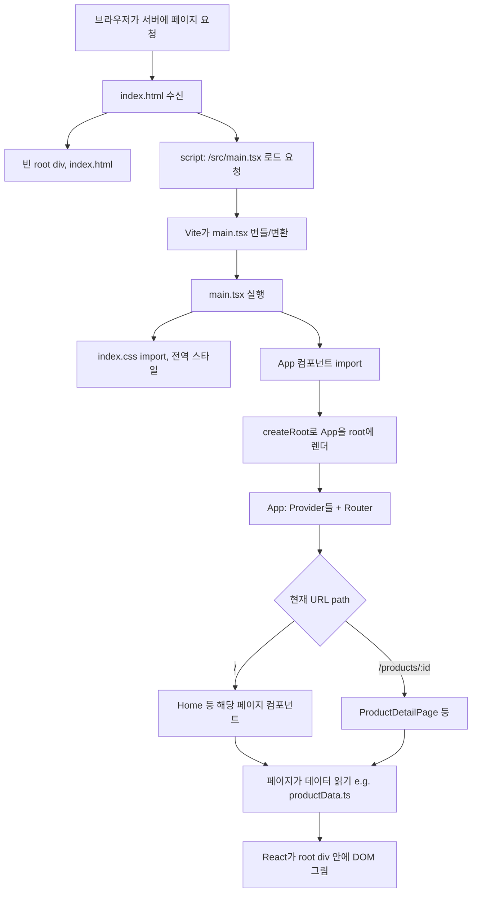
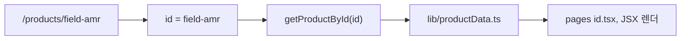

# 웹사이트가 켜지는 순서와 핵심 파일 역할

이 문서는 두 부분으로 나뉩니다.

1. **기술 스택 원론** — HTML, CSS, Tailwind, JavaScript, TypeScript, React, JSX, Vite가 각각 무엇인지, 서로 어떻게 이어지는지 (처음 보시는 분용).
2. **이 저장소의 파일** — `client/src` 기준으로 `main.tsx`, `App.tsx` 등 실제 파일이 하는 일과 순서도.

원론을 건너뛰고 싶다면 **3. `main.tsx`** 절부터 보시면 됩니다.

**순서도(7·8절):** 아래 도표는 **mermaid**용 펜스 코드 블록(세 개의 백틱 다음 줄에 `mermaid`로 시작하는 형식)입니다. Cursor / VS Code **마크다운 미리보기**(Windows: `Ctrl+Shift+V`)에서 **Markdown Preview Mermaid Support** 확장([`bierner.markdown-mermaid`](https://marketplace.visualstudio.com/items?itemName=bierner.markdown-mermaid))으로 렌더링하도록 맞춰 두었습니다. **Mermaid Chart** 등 다른 Mermaid 미리보기 확장과 동시에 켜 두면 도표가 깨지거나 오류가 날 수 있으니, bierner만 쓸 때는 나머지는 끄는 것을 권장합니다.

---

## 1. 기술 스택 원론: 각각이 무엇인가

웹 프론트엔드를 “한 줄씩”만 짚어 보면 다음과 같습니다.

### HTML

문서의 **뼈대**입니다. “제목이 여기, 버튼이 여기, 빈 상자가 여기”처럼 **무엇이 있는지**만 적습니다. 이 프로젝트의 `index.html`에는 `<div id="root"></div>` 같은 **빈 상자** 하나가 있고, 나머지 화면은 JavaScript(React)가 채웁니다.

### CSS

**모양**입니다. 색, 글자 크기, 여백, 가로·세로 배치 등 “**어떻게 보일지**”를 정합니다. 예전에는 `.css` 파일에 직접 많이 썼고, 이 프로젝트는 그 위에 **Tailwind**를 얹어 둔 형태입니다.

### Tailwind CSS

**미리 정해 둔 짧은 클래스 이름**으로 스타일을 붙이는 방식입니다. 예: `flex`, `gap-4`, `bg-primary` → 각각 “가로 나열”, “간격”, “배경색” 등입니다.

브라우저는 Tailwind 클래스 문자열만으로는 스타일을 모릅니다. **빌드·개발 서버 과정**에서 PostCSS와 `tailwind.config.ts` 설정이 이 클래스들을 **일반 CSS 규칙으로 펼쳐** 줍니다. `index.css` 맨 위 `@tailwind ...`와 `:root`의 CSS 변수(`--primary` 등)가 테마와 연결됩니다.

**한 줄:** Tailwind = “CSS를 빠르게 쓰기 위한 **약속된 클래스 이름** + 그걸 진짜 CSS로 바꿔 주는 파이프라인”.

### JavaScript

브라우저 안에서 **동작**을 만드는 언어입니다. 버튼 클릭, 화면 갈아끼우기, 서버와 통신 등. 이 사이트는 주소가 바뀔 때마다 내용을 바꾸는 **SPA**라서 JavaScript(와 React)가 중심입니다.

### TypeScript

**JavaScript + 타입 검사**입니다. “이 변수는 문자열”처럼 규칙을 적어 두면 에디터와 `tsc`가 잘못된 사용을 미리 잡아 줍니다. 브라우저는 TypeScript를 직접 실행하지 않고, **Vite**가 빌드할 때 처리합니다. `tsconfig.json`에 검사 대상 폴더와 `@/` 같은 경로 별칭이 정의돼 있습니다.

**한 줄:** TypeScript = “같은 생태계인데 **실수 줄이려고 타입을 붙인** JavaScript”.

### React

UI를 **작은 단위(컴포넌트)** 로 나누어 만드는 라이브러리입니다. 상태가 바뀌면 “어디만 다시 그릴지” 정리해 줍니다. 화면 코드는 보통 `.tsx` 파일에 있습니다.

**한 줄:** React = “화면을 **조각**으로 짜고, 데이터가 바뀔 때 **갱신**을 도와주는 라이브러리”.

### JSX

JavaScript 안에 `<div>...</div>`처럼 **태그를 섞어 쓰는 문법**입니다. 빌드 시 React가 이해할 수 있는 형태로 바뀝니다. 그래서 `App.tsx` 안에 HTML과 비슷한 코드가 보입니다.

**한 줄:** JSX = “JavaScript 파일 안에서 **마크업을 자연스럽게 쓰기 위한 문법**”.

### Vite

**개발 서버**와 **프로덕션 빌드**를 담당합니다. 저장 시 빠른 반영(HMR), `import`로 이어진 파일들을 브라우저가 실행할 수 있는 형태로 묶기, TypeScript·JSX 처리 등이 이 도구의 역할입니다. `vite.config.ts`에 “프론트 루트는 `client`”, `@` 별칭 등이 적혀 있습니다.

**한 줄:** Vite = “**소스를 브라우저가 실행할 형태로 바꾸고**, 개발할 때 **서버를 띄우는 도구**”.

### 역할 비유 표

| 이름 | 비유 / 역할 |
|------|----------------|
| HTML | 집 **구조도** (칸의 위치) |
| CSS | **인테리어** (색, 간격, 글꼴) |
| Tailwind | 인테리어를 **짧은 약어 클래스**로 빠르게 적는 방식 + 진짜 CSS로 풀어 주는 체인 |
| JavaScript | 집 안에서 **움직이는 것** |
| TypeScript | JavaScript에 **타입 규칙** 추가 |
| React | 화면을 **조각(컴포넌트)** 으로 짜고 갱신 정리 |
| JSX | JS 안에 **태그**를 쓰는 문법 |
| Vite | 변환·번들·개발 서버 |

---

## 2. 위 기술들이 맞물려 동작하는 흐름 (개발 중 접속 시)

아래는 **`npm run dev` / `dev:win`으로 서버를 띄운 뒤** 브라우저로 들어왔을 때의 개념적 순서입니다. (이 저장소는 Node의 `server/index.ts`가 Express를 띄우고, 개발 시 Vite를 붙이는 구조입니다.)

1. 브라우저가 **`index.html`**을 받습니다. `<div id="root">`는 비어 있고, `<script src="/src/main.tsx">`로 시작 스크립트만 연결돼 있습니다.
2. **`main.tsx`**를 요청하면 Vite가 TypeScript/JSX를 브라우저가 돌릴 수 있는 형태로 **변환**해 줍니다.
3. **`main.tsx`** 실행: **`index.css`**를 불러와 전역 스타일(Tailwind 펼침 결과 포함)을 적용하고, **`App`**을 `root` 안에 **그립니다**.
4. **`App.tsx`**: 공통 래퍼(알림·툴팁·React Query 등)를 씌운 뒤, **현재 URL**에 맞는 페이지 컴포넌트를 고릅니다 (**wouter**).
5. 각 **페이지 `.tsx`**: **JSX**로 UI를 쓰고 **`className`**에 **Tailwind**를 붙입니다. 제품 문구 등은 **`productData.ts`** 같은 **TypeScript** 파일에서 읽을 수 있습니다 (현재는 대부분 백엔드 API 없이 동작).
6. 사용자가 **다른 주소**로 이동하면 HTML을 다시 받지 않고, **같은 React 앱 안에서** 페이지만 바뀝니다 (SPA).
7. **배포** 시에는 Vite가 미리 파일을 묶고, 프로덕션에서는 `server`가 그 결과를 나릅니다. 진입 개념은 같고 파일 이름만 `.js` 번들 등으로 바뀝니다.

이 흐름을 도식으로 보면 **7. 순서도** 절과 같습니다.

---

## 3. `main.tsx` — React 앱의 “시동”

**역할:** 브라우저가 가장 먼저 실행하는 **React 진입점(entry point)** 입니다.

- `index.html` 안의 `<div id="root">`를 찾습니다.
- `createRoot(...).render(<App />)`로 **전체 UI 트리의 뿌리**를 그 `div` 안에 그립니다.
- 같은 파일에서 `import "./index.css"`로 **전역 스타일**을 불러옵니다. (5절 `index.css` 참고)

```1:5:client/src/main.tsx
import { createRoot } from "react-dom/client"; 
import App from "./App";
import "./index.css";

createRoot(document.getElementById("root")!).render(<App />);
```

**한 줄 요약:** “HTML 껍데기에 React를 붙이고, `App`을 화면에 올린다.”

---

## 4. `App.tsx` — 전역 래퍼 + 주소(URL)에 따른 페이지 선택

**역할:** 앱 전체를 감싸는 **공통 설정**과 **라우팅(어떤 URL에 어떤 페이지를 보여줄지)** 을 담당합니다.

- `QueryClientProvider`: 서버/API 데이터를 캐시·요청할 때 쓰는 React Query 설정 (일부 페이지에서 사용).
- `TooltipProvider`, `Toaster`: UI 도구팁·토스트 알림.
- `Router`: **wouter** 라이브러리로 `path`와 **페이지 컴포넌트**를 연결합니다.  
  예: `/products/field-amr` → `ProductDetailPage`.

```56:64:client/src/App.tsx
function App() {
  return (
    <QueryClientProvider client={queryClient}>
      <TooltipProvider>
        <Toaster />
        <Router />
      </TooltipProvider>
    </QueryClientProvider>
  )
}
```

**한 줄 요약:** “공통 기능을 씌운 뒤, 주소에 맞는 `pages/...` 화면 하나를 고른다.”

---

## 5. `index.css` — 전역 스타일과 디자인 토큰

**역할:** **사이트 전체에 한 번** 적용되는 CSS입니다.

- 맨 위 `@tailwind base/components/utilities`로 **Tailwind** 기본 스타일을 불러옵니다.  
  그래서 각 `.tsx`에서 `className="flex gap-4 ..."` 같은 클래스가 동작합니다.
- `:root` 등에 **CSS 변수**(`--background`, `--primary` 등)를 정의해 **색·글꼴·그림자** 같은 테마를 통일합니다. shadcn/ui 계열 컴포넌트가 이 변수들을 참조합니다.
- 다크 모드 등 추가 규칙이 같은 파일 아래에 이어질 수 있습니다.

**한 줄 요약:** “Tailwind를 켜고, 전 사이트가 공유하는 색·간격 같은 규칙의 바탕을 깐다.”

---

## 6. HTML에서 스크립트가 연결되는 방식

브라우저는 먼저 `client/index.html`을 받습니다. 여기서 **React 코드의 시작 파일**이 지정됩니다.

```13:16:client/index.html
  <body>
    <div id="root"></div>
    <script type="module" src="/src/main.tsx"></script>
  </body>
```

개발 모드에서는 **Vite**가 이 `/src/main.tsx` 요청을 받아 TypeScript/JSX를 브라우저가 이해할 수 있는 형태로 변환해 줍니다.

---

## 7. 순서도: 처음부터 화면이 그려질 때까지

아래는 **개발 환경(`npm run dev` / `dev:win`)** 기준 흐름입니다. Node의 `server/index.ts`가 Express로 서버를 띄우고, 개발 시에는 그 안에서 Vite 미들웨어가 프론트를 서빙하는 구조입니다.



**URL이 바뀔 때:** `wouter`의 `Route`가 다른 페이지 컴포넌트를 선택하고, `ScrollToTop`이 스크롤을 맨 위로 올립니다. 전체 HTML을 다시 받지 않고 **같은 `main.tsx` → `App` 안에서 화면만 바뀌는** SPA 동작입니다.

---

## 8. 한 페이지 안에서 데이터는 어디서 오나 (예: 제품 상세)

`ProductDetailPage`는 URL의 `:id`로 `productData.ts`에서 객체를 찾습니다. 이 데이터는 **빌드에 포함된 프론트 코드**에 있으며, 현재 구조에서는 **별도 백엔드 API 호출 없이**도 동작합니다.



---

## 9. 파일 역할 요약 표

| 파일 | 역할 |
|------|------|
| `client/index.html` | 최소 HTML 껍데기, `#root`, `main.tsx` 연결 |
| `client/src/main.tsx` | React 마운트, `App` 렌더, `index.css` 로드 |
| `client/src/App.tsx` | 전역 Provider, URL별 페이지 라우팅 |
| `client/src/index.css` | Tailwind + 전역 테마(CSS 변수) |
| `client/src/pages/...` | 각 URL에 대응하는 화면 |
| `client/src/lib/...` | 페이지가 쓰는 데이터·유틸 (예: `productData.ts`) |

---

## 10. 프로덕션 빌드 시 (참고)

`npm run build` 후에는 Vite가 정적 파일로 묶고, `server`가 프로덕션 모드에서 그 결과물을 서빙합니다. 브라우저 입장에서는 여전히 **HTML → JS 번들 실행 → `main.tsx`와 동일한 진입 로직**이지만, 파일 이름은 해시가 붙은 `.js` 등으로 바뀝니다.

자세한 배포는 저장소의 `docs/DEPLOYMENT.md`를 참고하면 됩니다.
